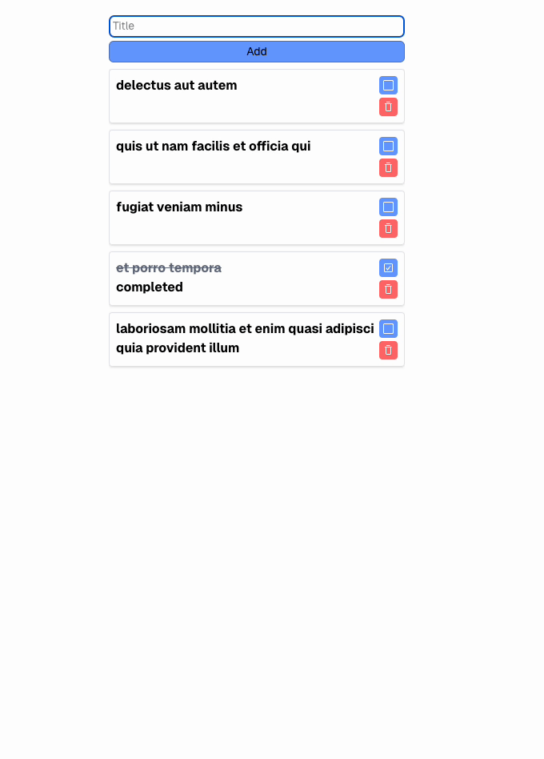

# 📝 Task Management App

A simple **Task Management** app built with **Next.js 14, React 19, TypeScript, and Tailwind CSS**.  
This app allows users to **add, list, toggle, and delete tasks** with **local storage** support.

---

## 🚀 Features
✅ Add new tasks  
✅ Toggle task completion  
✅ Delete tasks  
✅ Persistent storage using `localStorage`  
✅ Suspense-based loading with skeleton UI  
✅ Fully responsive design

---

## 📦 Tech Stack
- **Next.js 14 (App Router)**
- **React 19**
- **TypeScript**
- **Tailwind CSS**
- **Framer Motion (Animations)**
- **Axios (Fetching Data)**
- **Local Storage (Persistence)**

---

## ⚡ Getting Started
1. **Clone the project**
2. **Install modules:**

run

```bash
npm install
```
or
```bash
yarn install
```
run the development server:

```bash
npm run dev
# or
yarn dev
# or
pnpm dev
# or
bun dev
```

Open [http://localhost:3000](http://localhost:3000) with your browser to see the result.

## Demo

</img>
